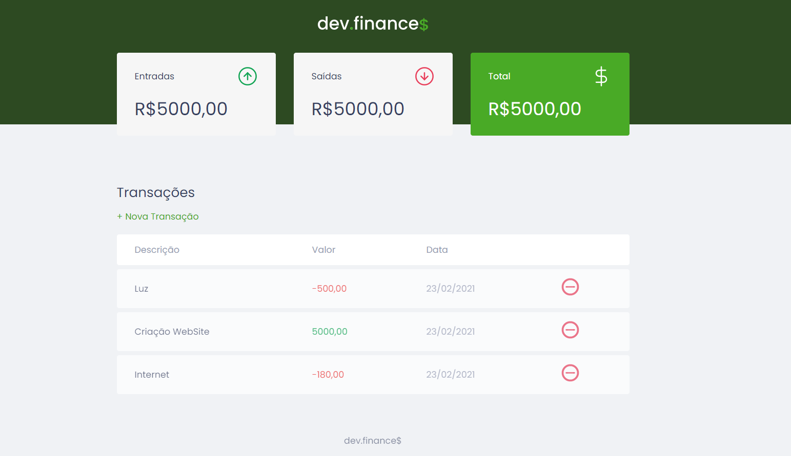

<h1 align="center">
  
</h1>

 

 

  

## 🚀 Tecnologias

Esse projeto foi desenvolvido com as seguintes tecnologias:

- HTML
- CSS
- JavaScript
- LocalStorage

## 💻 Projeto

O dev.finances é uma aplicação de controle financeiro, onde é possível cadastrar e excluir transações e ver o saldo de entrada e saída 💰

---

Feito com ♥ by Marcio Filadelfo

